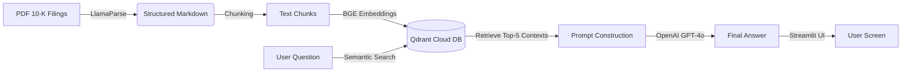

# 📊 Financial RAG Analyst: SEC 10-K Insight Engine

[](https://share.streamlit.io/your-username/financial-rag-analyst)


A production-ready **Retrieval-Augmented Generation (RAG)** application that analyzes complex financial documents (SEC 10-K filings) with high precision. Built with **LlamaIndex**, **Qdrant**, and **OpenAI**, deployed on **Streamlit Cloud**.

## 🚀 Live App
**[Click here to try the Live App](https://financial-rag-analyst-sam.streamlit.app/)**
## 📸 Interface Preview
.png)

## 💡 What It Does
Financial reports like SEC 10-K filings are hundreds of pages long, filled with complex tables and dense legal text. Standard LLMs often hallucinate specific numbers when asked to compare data across these documents.

**Financial RAG Analyst** solves this by:
1.  **Ingesting** raw PDFs using **LlamaParse** to accurately extract table structures.
2.  **Indexing** data into **Qdrant Cloud** using semantic vector embeddings.
3.  **Retrieving** the exact context (e.g., page 52, Table 3) before answering.
4.  **Synthesizing** a hallucination-free answer using GPT-4o (or Groq).

## 🏗️ System Architecture


## ⚡ Key Features
Multi-Document Analysis: Compare metrics across Apple, Microsoft, and Google simultaneously.

Table-Aware Parsing: accurately reads financial tables that confuse standard PDF parsers.

Source-Grounded Truth: Answers are strictly based on the provided filings, eliminating "model bias."

Cloud-Native: Vector data persists in Qdrant Cloud; App runs on Streamlit Community Cloud.

## 🛠️ Tech Stack
Framework: LlamaIndex

Frontend: Streamlit

Vector Database: Qdrant

Parsing: LlamaParse

LLM: OpenAI GPT-4o (Configurable to Groq/Llama3)

## 🏎️ Quick Start (Run Locally)
1. Clone the Repo

Bash
```text

git clone [https://github.com/your-username/financial-rag-analyst.git](https://github.com/your-username/financial-rag-analyst.git)
cd financial-rag-analyst
```
2. Install Dependencies

Bash
```text
pip install -r requirements.txt
```
3. Set Up Secrets Create a .streamlit/secrets.toml file (or set environment variables) with your keys:

Ini, TOML
```text
# .streamlit/secrets.toml
OPENAI_API_KEY = "sk-..."
QDRANT_URL = "[https://your-cluster-url.qdrant.io](https://your-cluster-url.qdrant.io)"
QDRANT_API_KEY = "your-qdrant-key"
```
4. Run the App

Bash
```text

streamlit run app.py
```
## 🧪 Demo Questions to Try

"Compare the cloud revenue growth rate of Microsoft Azure vs. Google Cloud for 2024."

"What are the top risk factors listed by Apple regarding AI regulation?"

"How much capital did Microsoft return to shareholders via buybacks in 2024?"

## 📂 Repository Structure
```text
├── app.py                 # Main Streamlit application
├── requirements.txt       # Python dependencies
├── ingest_data.py         # Script to parse PDFs & upload to Qdrant
├── sec-edgar-filings/     # Raw PDF documents (Not included in repo)
└── README.md              # Documentation
```
## 🤝 Contributing
Pull requests are welcome! For major changes, please open an issue first to discuss what you would like to change.

## 📄 License
MIT
