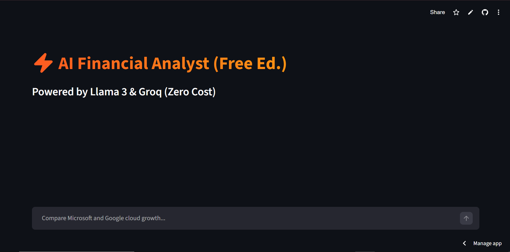
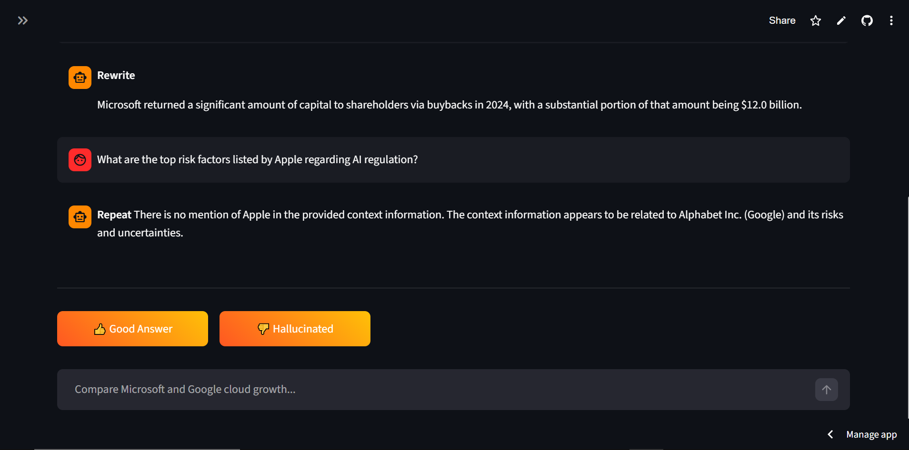
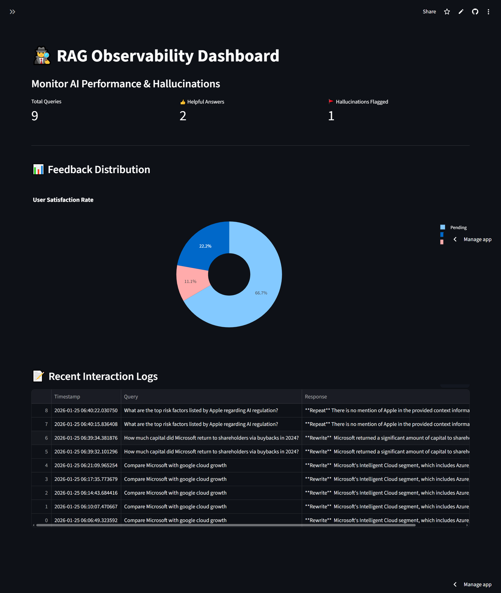
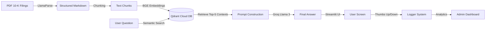

# 📊 Financial RAG Analyst: SEC 10-K Insight Engine

[](https://financial-rag-analyst-sam.streamlit.app/)


A production-ready **Retrieval-Augmented Generation (RAG)** application that analyzes complex financial documents (SEC 10-K filings) with high precision. Built with **LlamaIndex**, **Qdrant**, and **Groq (Llama 3)**, deployed on **Streamlit Cloud**.

**Now features Enterprise Observability:** Includes a secure Admin Dashboard to track hallucinations, monitor latency, and gather user feedback (RLHF).

## 🚀 Live App
**[Click here to try the Live App](https://financial-rag-analyst-sam.streamlit.app/)**

## 📸 Interface Preview
### 1. The Analyst (Chat Interface)
<p align="center">
  
  &nbsp; &nbsp; &nbsp; &nbsp;
  
</p>

### 2. The Observer (Admin Dashboard)
*Monitor system performance and user feedback in real-time.*
<p align="center">
  
</p>

## 💡 What It Does
Financial reports like SEC 10-K filings are hundreds of pages long, filled with complex tables and dense legal text. Standard LLMs often hallucinate specific numbers when asked to compare data across these documents.

**Financial RAG Analyst** solves this by:
1.  **Ingesting** raw PDFs using **LlamaParse** to accurately extract table structures.
2.  **Indexing** data into **Qdrant Cloud** using semantic vector embeddings.
3.  **Retrieving** the exact context (e.g., page 52, Table 3) before answering.
4.  **Synthesizing** a hallucination-free answer using **Llama 3 via Groq**.
5.  **Monitoring** quality via a feedback loop (Thumbs Up/Down) stored in a secure log.

## 🏗️ System Architecture


## ⚡ Key Features
**Multi-Document Analysis**: Compare metrics across Apple, Microsoft, and Google simultaneously.

**Table-Aware Parsing**: accurately reads financial tables that confuse standard PDF parsers.

**Source-Grounded Truth**: Answers are strictly based on the provided filings, eliminating "model bias."

**Cloud-Native**: Vector data persists in Qdrant Cloud; App runs on Streamlit Community Cloud.

**AI Observability**: Built-in logging system to track user queries and flag hallucinations.

**Zero-Cost Inference**: Powered by Groq's free tier, making the app blazing fast and free to run.

## 🛠️ Tech Stack
**Framework**: LlamaIndex

**Frontend**: Streamlit

**Vector Database**: Qdrant

**Parsing**: LlamaParse

**DevOps**: Docker, GitHub Actions (CI/CD)

**LLM**: Meta Llama 3 (via Groq API)

## 🏎️ Quick Start (Run Locally)
1. Clone the Repo

Bash
```text

git clone [https://github.com/SIYAM1809/Financial-RAG-Analyst.git](https://github.com/SIYAM1809/Financial-RAG-Analyst.git)
cd Financial-RAG-Analyst
```
2. Install Dependencies

Bash
```text
pip install -r requirements.txt
```
3. Set Up Secrets Create a .streamlit/secrets.toml file (or set environment variables) with your keys:

Ini, TOML
```text
# .streamlit/secrets.toml
GROQ_API_KEY = "gsk_..."
QDRANT_URL = "[https://your-cluster-url.qdrant.io](https://your-cluster-url.qdrant.io)"
QDRANT_API_KEY = "your-qdrant-key"
ADMIN_PASSWORD = "admin123"
```
4. Run the App

Bash
```text

streamlit run app.py
```
## 🧪 Demo Questions to Try

**"Compare the cloud revenue growth rate of Microsoft Azure vs. Google Cloud for 2024."**

**"What are the top risk factors listed by Apple regarding AI regulation?"**

**"How much capital did Microsoft return to shareholders via buybacks in 2024?"**

## 📂 Repository Structure
```text
├── app.py                 # Main Streamlit application
├── logger.py              # Logging system for observability
├── pages/
│   └── admin_dashboard.py # Secure analytics dashboard
├── requirements.txt       # Python dependencies
├── Dockerfile             # Container configuration
├── .github/workflows/     # CI/CD Automated Testing
├── ingest_data.py         # Script to parse PDFs & upload to Qdrant
├── sec-edgar-filings/     # Raw PDF documents (Not included in repo)
└── README.md              # Documentation
```
## 🤝 Contributing
Pull requests are welcome! For major changes, please open an issue first to discuss what you would like to change.

## 📄 License
MIT
